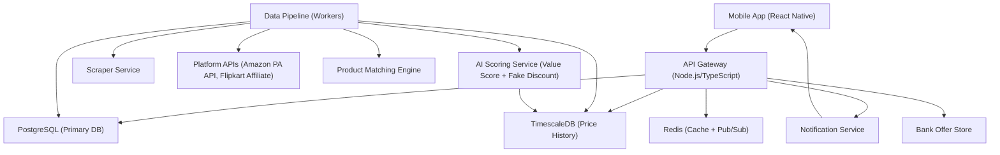

# Design Document: Discount Aggregator

## Overview

The Discount Aggregator is a full-stack application that collects discounted product listings from major e-commerce platforms (Amazon, Flipkart, etc.), normalizes and matches products across platforms, runs AI-based fake discount detection, and surfaces deals to users with smart payment optimization. Users are redirected to source platforms for actual purchases, maintaining full transparency.

The system is composed of a React Native mobile app (iOS + Android), a Node.js/TypeScript backend API, background data pipeline workers, and an AI scoring service.

---

## Architecture



---

## Components and Interfaces

### 1. Mobile App (React Native)
- Home feed (trending deals, personalized)
- Product detail page with price comparison table, Value Score badge, Fake Discount warning, Price History chart
- Search and filter UI
- Cart and Wishlist management
- Bank offer optimizer panel
- Deal Feed (crowdsourced)
- Premium: Auto-Checkout Bot settings
- Auth screens (login, register, OAuth)

### 2. API Gateway (Node.js/TypeScript + Express)
- REST endpoints for all client interactions
- JWT-based authentication middleware
- Rate limiting and request validation
- Delegates heavy computation to background workers via job queues (BullMQ + Redis)

Key endpoint groups:
- `GET /deals` — paginated, filtered deal listings
- `GET /deals/:id` — deal detail with price history and bank offers
- `GET /products/:id/compare` — cross-platform comparison
- `POST /cart`, `GET /cart` — cart management
- `POST /wishlist`, `GET /wishlist` — wishlist management
- `POST /feed/submit` — crowdsourced deal submission
- `POST /autocheckout/trigger` — set auto-checkout trigger (premium)
- `GET /search` — full-text product search

### 3. Data Pipeline Workers (BullMQ)
- **Ingestion Worker**: Polls platform APIs and scraper service on a 30-minute schedule per platform
- **Price Update Worker**: Detects price changes, writes to Price_History, triggers notifications
- **Matching Worker**: Runs product matching on newly ingested listings
- **AI Scoring Worker**: Computes Value_Score and Fake_Discount flag after price updates
- **Bank Offer Worker**: Refreshes bank offer data daily

### 4. Scraper Service
- Headless browser pool (Playwright) for platforms without APIs
- Proxy rotation to avoid blocks
- Structured output: `{ platform, product_id, name, price, original_price, discount_pct, url, image_url, attributes }`
- Retry with exponential backoff on failure
- Failure logged to monitoring (platform, timestamp, error)

### 5. Product Matching Engine
- Pipeline:
  1. Tokenize and normalize product names (lowercase, remove stop words, expand abbreviations)
  2. Extract structured attributes: brand, model number, color, size, capacity
  3. Compute TF-IDF cosine similarity on name tokens
  4. Hard-filter by brand and model number if present
  5. Score = weighted sum: name_similarity (0.4) + brand_match (0.3) + model_match (0.2) + attribute_overlap (0.1)
  6. Threshold: score ≥ 0.7 → Matched_Product; score 0.5–0.7 → Unverified match
- Matched products stored in `product_matches` table with confidence score

### 6. AI Scoring Service (Python/FastAPI)
- **Value Score computation**:
  - Inputs: current price, original price, Price_History (90 days), category average discount
  - Formula: `value_score = (genuine_discount_pct * 0.6) + (price_vs_history_percentile * 0.3) + (category_rank * 0.1)`
  - `genuine_discount_pct` = discount based on 90-day median price (not listed original price)
  - Output: integer 0–100
- **Fake Discount detection**:
  - IF `listed_original_price > p90(price_history_90d)` → flag as `FAKE_DISCOUNT`
  - IF price history < 7 days → set `low_confidence = true`
- Exposed as internal HTTP endpoint called by AI Scoring Worker

### 7. Notification Service
- Push notifications via Firebase Cloud Messaging (FCM)
- Trigger events:
  - Wishlist price drop ≥ 5%
  - Wishlist product flagged as Fake Discount
  - Auto-checkout attempt result (success/failure)
  - Platform staleness warning (> 60 min unreachable)

### 8. Bank Offer Store
- Curated JSON store updated daily by Bank Offer Worker
- Schema: `{ platform, bank_name, card_types[], discount_type (flat/percent), value, max_cap, min_order, valid_until }`
- Effective price computation: `effective_price = listed_price - flat_discount - min(percent_discount * listed_price, max_cap)`

---

## Data Models

### product_listings
```
id: uuid
platform: enum (AMAZON, FLIPKART, ...)
platform_product_id: string
name: string
brand: string
model_number: string
category: string
current_price: decimal
original_price: decimal
discount_pct: decimal
url: string
image_url: string
attributes: jsonb
value_score: integer (0-100)
fake_discount_flag: boolean
low_confidence_score: boolean
last_fetched_at: timestamp
is_available: boolean
```

### price_history (TimescaleDB hypertable)
```
product_listing_id: uuid
platform: enum
price: decimal
recorded_at: timestamp (partition key)
```

### product_matches
```
id: uuid
canonical_product_id: uuid
listing_ids: uuid[]
confidence_score: decimal
verified: boolean
created_at: timestamp
```

### users
```
id: uuid
email: string (unique)
password_hash: string
auth_provider: enum (EMAIL, GOOGLE, APPLE)
is_premium: boolean
last_active_at: timestamp
created_at: timestamp
```

### payment_methods
```
id: uuid
user_id: uuid
token: string (tokenized reference only)
bank_name: string
card_type: string
last4: string
```

### carts
```
id: uuid
user_id: uuid
items: jsonb (array of { listing_id, platform, added_at })
updated_at: timestamp
```

### wishlists
```
id: uuid
user_id: uuid
listing_id: uuid
target_price: decimal (nullable)
added_at: timestamp
last_notified_at: timestamp
```

### deal_feed_submissions
```
id: uuid
user_id: uuid
url: string
platform: enum
listing_id: uuid (resolved)
description: string
value_score: integer
upvotes: integer
downvotes: integer
is_hidden: boolean
submitted_at: timestamp
```

### autocheckout_triggers
```
id: uuid
user_id: uuid
listing_id: uuid
target_price: decimal
is_active: boolean
created_at: timestamp
last_attempted_at: timestamp
```

### autocheckout_audit_log
```
id: uuid
trigger_id: uuid
user_id: uuid
action: enum (TRIGGERED, SUCCESS, FAILED, CANCELLED)
details: jsonb
occurred_at: timestamp
```

---

## Correctness Properties

A property is a characteristic or behavior that should hold true across all valid executions of a system — essentially, a formal statement about what the system should do. Properties serve as the bridge between human-readable specifications and machine-verifiable correctness guarantees.

### Property 1: Price history append-only invariant
*For any* product listing, every recorded price entry in Price_History must have a `recorded_at` timestamp strictly greater than all previous entries for that listing — the history must be monotonically increasing in time.
**Validates: Requirements 1.6**

### Property 2: Value Score bounds
*For any* product listing with a computed Value_Score, the score must be an integer in the range [0, 100] inclusive.
**Validates: Requirements 4.1**

### Property 3: Fake Discount flag consistency
*For any* product listing where `listed_original_price > p90(price_history_90d)`, the `fake_discount_flag` must be `true`. Conversely, if `listed_original_price ≤ p90(price_history_90d)`, the flag must be `false`.
**Validates: Requirements 4.2, 4.3**

### Property 4: Low confidence flag when history is sparse
*For any* product listing where fewer than 7 days of Price_History exist, the `low_confidence_score` field must be `true`.
**Validates: Requirements 4.5**

### Property 5: Effective price never exceeds listed price
*For any* deal and applicable bank offer, the computed effective price must always be less than or equal to the listed price.
**Validates: Requirements 5.4**

### Property 6: Match confidence threshold enforcement
*For any* product match with confidence score < 0.7, the match must be marked `verified = false`. For any match with confidence ≥ 0.7, the match must be marked `verified = true`.
**Validates: Requirements 3.3, 3.4**

### Property 7: Cart persistence round-trip
*For any* user session, adding items to the Cart and then retrieving the Cart must return all added items with no losses or duplicates.
**Validates: Requirements 7.1, 7.6**

### Property 8: Wishlist price-drop notification threshold
*For any* Wishlist item where the current price has dropped by ≥ 5% compared to the price at time of adding, a notification must have been triggered (last_notified_at updated).
**Validates: Requirements 7.4**

### Property 9: Deal feed vote ratio hiding
*For any* deal submission with at least 10 votes where `upvotes / (upvotes + downvotes) < 0.20`, the `is_hidden` field must be `true`.
**Validates: Requirements 8.5**

### Property 10: Auto-checkout audit log completeness
*For any* auto-checkout trigger that fires, there must exist at least one corresponding entry in `autocheckout_audit_log` with a matching `trigger_id` and a non-null `occurred_at`.
**Validates: Requirements 9.6**

### Property 11: Payment method count invariant
*For any* user, the count of active saved payment methods must never exceed 10.
**Validates: Requirements 10.5**

### Property 12: Scraper output schema completeness
*For any* successfully scraped product, the output object must contain all required fields: platform, product_id, name, price, url — none of these may be null or empty.
**Validates: Requirements 1.3**

---

## Error Handling

| Scenario | Handling |
|---|---|
| Platform API / scraper failure | Retry with exponential backoff (3 attempts), then log failure; serve cached data with staleness warning |
| Platform unreachable > 60 min | Surface platform-level warning in UI (Requirement 2.4) |
| Product match below confidence | Mark as Unverified, show to user with warning label |
| Auto-checkout failure | Notify user within 5 min, preserve trigger for retry (Requirement 9.5) |
| Deal feed URL invalid / unsupported | Return 400 with descriptive error; do not create listing |
| Value Score computation with insufficient history | Set `low_confidence_score = true`, still compute best-effort score |
| Auth token expired | Return 401; client redirects to login |
| Payment method limit exceeded | Return 400: "Maximum 10 payment methods allowed" |

---

## Testing Strategy

### Dual Testing Approach

Both unit tests and property-based tests are required and complementary.

- **Unit tests**: Validate specific examples, edge cases, error conditions, and integration points
- **Property-based tests**: Validate universal properties across randomized inputs (minimum 100 iterations each)

### Property-Based Testing Library

- Backend (TypeScript): **fast-check**
- AI Service (Python): **Hypothesis**

### Property Test Annotations

Each property-based test must include a comment in this format:
```
// Feature: discount-aggregator, Property N: <property text>
```

### Coverage Plan

| Area | Unit Tests | Property Tests |
|---|---|---|
| Value Score computation | Specific score examples, edge values | Property 2 (bounds), Property 3 (fake discount consistency), Property 4 (low confidence) |
| Product Matching Engine | Known match pairs, known non-matches | Property 6 (confidence threshold enforcement) |
| Effective price computation | Flat, percent, cap scenarios | Property 5 (effective ≤ listed) |
| Price History writes | Correct append behavior | Property 1 (append-only invariant) |
| Cart CRUD | Add, remove, retrieve | Property 7 (round-trip) |
| Wishlist notifications | 5% drop triggers, < 5% does not | Property 8 (notification threshold) |
| Deal feed voting | Hide at threshold, show above | Property 9 (vote ratio hiding) |
| Auto-checkout audit | Log created on trigger | Property 10 (audit completeness) |
| Payment method management | Add, remove, count | Property 11 (count invariant) |
| Scraper output | Valid/invalid outputs | Property 12 (schema completeness) |

### Unit Test Focus Areas
- Auth flows: registration validation, password hashing, JWT lifecycle
- Search: full-text query, filter combinations, empty result handling
- Redirect logic: deep link construction, platform routing
- Bank offer matching: card type lookup, offer stacking rules
- Notification triggers: FCM payload construction
